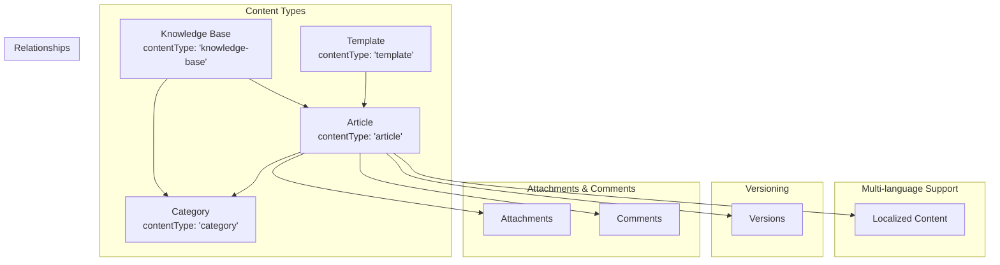
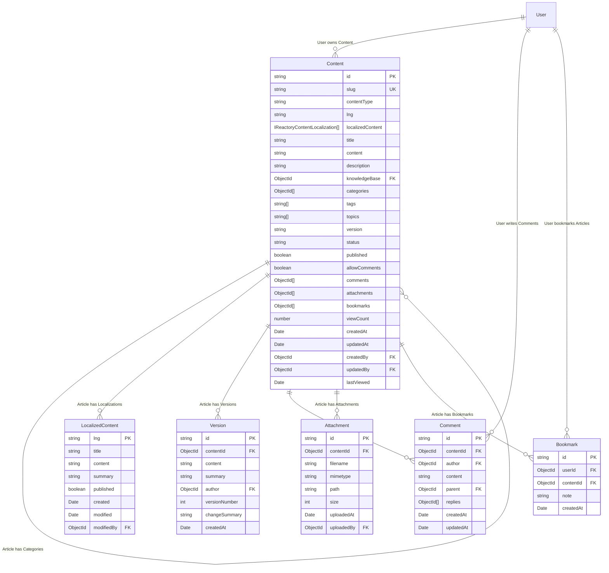
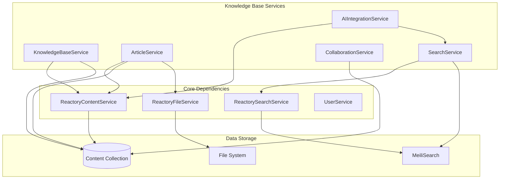
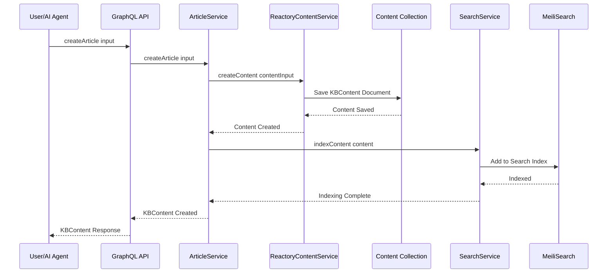
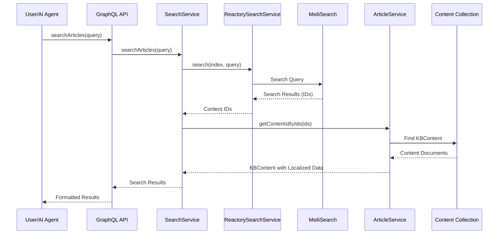
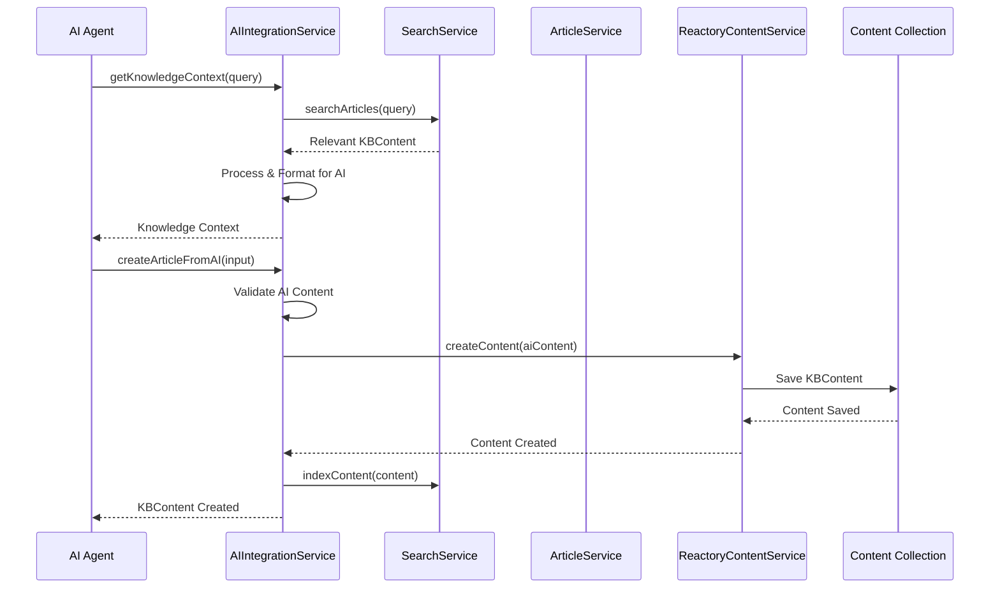
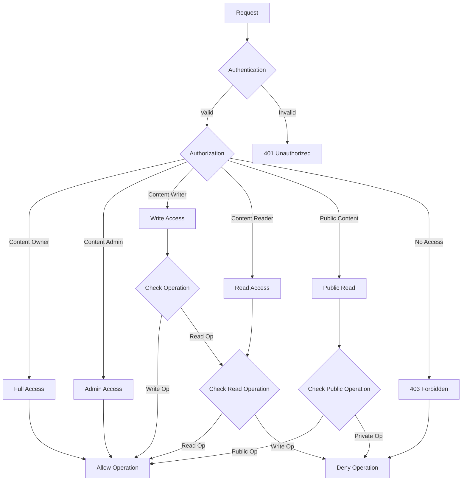
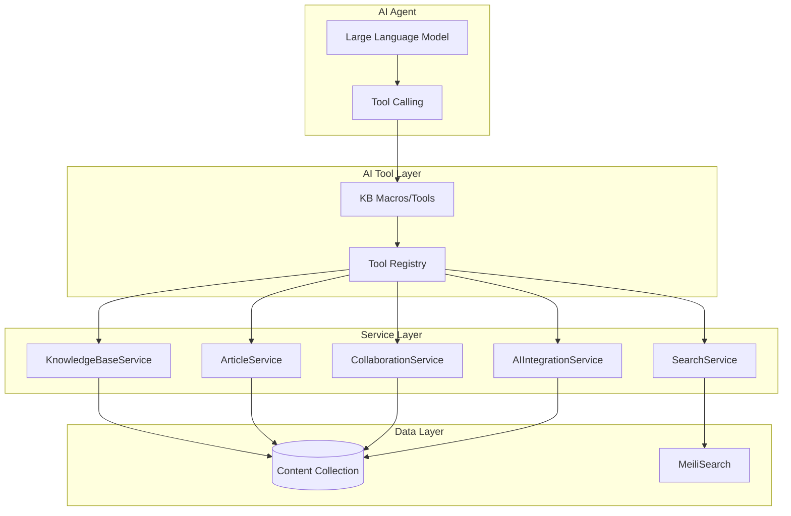

# Reactory Knowledge Base Module - Technical Specification

## Overview

The Reactory Knowledge Base (KB) Module is a comprehensive knowledge management system that extends the existing ReactoryContentService to provide structured knowledge base functionality. It enables both human users and AI agents to create, manage, and share knowledge bases with advanced features like versioning, collaboration, search, and AI integration.

## Architecture

### Module Structure

```
reactory-kb/
├── cli/                    # Command-line interface tools
├── services/              # Business logic services
├── models/                # Extended Content model definitions
├── graphql/               # GraphQL definitions
├── forms/                 # Form definitions
├── workflow/              # Workflow definitions
├── routes/                # REST API routes
├── middleware/            # Custom middleware
├── hooks/                 # Lifecycle hooks
├── types/                 # TypeScript type definitions
├── utils/                 # Utility functions
├── index.ts              # Module entry point
└── SPEC.md               # This specification
```

### Dependencies

The module depends on:
- **reactory-core**: Base Reactory functionality and Content model
- **ReactoryContentService**: Extended for KB articles and knowledge bases
- **ReactorySearchService**: Full-text search capabilities
- **ReactoryFileService**: File management for attachments

## Content Model Extensions

### Extended Content Schema

The Knowledge Base module extends the existing `IReactoryContent` interface with additional fields for specialized content management:

```typescript
// Extended Content Schema for Knowledge Base
interface IReactoryContent {
  // Existing base fields...
  id?: unknown;
  slug: string;
  title?: string;
  description?: string;
  content: string;
  translations?: IReactoryContentTranslation[];
  topics?: string[];
  template?: boolean;
  engine?: string;
  previewInputForm?: string;
  createdAt: Date;
  createdBy: ObjectId | IUser | IUserDocument;
  updatedAt: Date;
  updatedBy: ObjectId | IUser | IUserDocument;
  version?: string;
  published: boolean;
  roles?: string[];
  commentsAllowed?: boolean;
  comments?: ObjectId[] | IReactoryComment | IReactoryCommentDocument;
  commentRoles?: string[];
  partner?: IReactoryClient | IReactoryClientDocument | ObjectId;
  organization?: IOrganization | IOrganizationDocument | ObjectId;
  businessUnit?: IBusinessUnit | IBusinessUnitDocument | ObjectId;
  flags?: IContentFlag[];
  flagged?: boolean;

  // Knowledge Base specific extensions
  contentType?: string;           // Type of content (knowledge-base, article, category, template)
  lng?: string;                   // Default language ISO code (e.g., 'en', 'fr')
  localizedContent?: IReactoryContentLocalization[]; // Multi-language content variants

  // Knowledge Base relationships and metadata
  knowledgeBase?: ObjectId;       // Reference to parent KB (for articles)
  categories?: ObjectId[];        // Article categories
  tags?: string[];                // Article tags
  status?: string;                // Article status (draft, review, published, archived)
  allowComments?: boolean;        // Comments enabled
  attachments?: ObjectId[];       // File attachments
  bookmarks?: ObjectId[];         // User bookmarks
  viewCount?: number;             // View counter
  lastViewed?: Date;              // Last viewed timestamp
}

// Localized content structure
interface IReactoryContentLocalization {
  lng: string;                    // Language ISO code
  title?: string;                 // Localized title
  content?: string;               // Localized content
  summary?: string;               // Localized summary
  published: boolean;             // Publication status for this language
  created: Date;                  // When this localization was created
  modified: Date;                 // When this localization was last modified
  modifiedBy?: ObjectId;          // Who last modified this localization
}
```

### Content Type Usage

1. **knowledge-base**: Container for organizing articles
   - `contentType: 'knowledge-base'`
   - Acts as container for articles and defines permissions
   - May contain summary content in the main content field

2. **article**: Individual knowledge base articles
   - `contentType: 'article'`
   - `knowledgeBase`: Reference to parent KB
   - Full content with versioning and localization support
   - Supports comments, attachments, and bookmarks

3. **category**: Hierarchical categorization
   - `contentType: 'category'`
   - Used for organizing articles within a knowledge base
   - Can be nested through parent-child relationships

4. **template**: Reusable content templates
   - `contentType: 'template'`
   - Starting points for new articles
   - Can include placeholders and variables

5. **book**: Book format, supports nested contents
   - Module: Defines the module
   - Chapter: Defines a chapter
   - Section: Defines a section
      - Page: Page within a section

## Data Model

### Extended Content Model Architecture



### Content-Based Entity Relationships



### Content Type Hierarchy

1. **Knowledge Base Content** (`contentType: 'knowledge-base'`)
   - Acts as container for articles
   - Defines visibility and permissions
   - Contains KB-level metadata

2. **Article Content** (`contentType: 'article'`)
   - Individual knowledge articles
   - Belongs to a knowledge base
   - Supports multi-language content
   - Has versioning and attachments

3. **Category Content** (`contentType: 'category'`)
   - Hierarchical organization
   - Can be nested (parent/child relationships)
   - Used for article classification

4. **Template Content** (`contentType: 'template'`)
   - Reusable content structures
   - Starting points for new articles
   - Can include placeholders and variables

## Services Architecture

### Service Layer Overview



### KnowledgeBaseService

**Purpose**: Manages knowledge base entities using Content model with `contentType: 'knowledge-base'`

**Key Methods**:
- `createKnowledgeBase(input: CreateKBInput): Promise<KBContent>`
- `updateKnowledgeBase(id: string, input: UpdateKBInput): Promise<KBContent>`
- `deleteKnowledgeBase(id: string): Promise<boolean>`
- `getKnowledgeBase(id: string): Promise<KBContent>`
- `listKnowledgeBases(filter: KBFilter): Promise<KBContent[]>`
- `getKBArticles(kbId: string): Promise<KBContent[]>`
- `getKBCategories(kbId: string): Promise<KBContent[]>`

### ArticleService

**Purpose**: Handles article CRUD operations using Content model with `contentType: 'article'`

**Key Methods**:
- `createArticle(input: CreateArticleInput): Promise<KBContent>`
- `updateArticle(id: string, input: UpdateArticleInput): Promise<KBContent>`
- `deleteArticle(id: string): Promise<boolean>`
- `getArticle(id: string): Promise<KBContent>`
- `getArticleVersions(id: string): Promise<Version[]>`
- `publishArticle(id: string): Promise<KBContent>`
- `archiveArticle(id: string): Promise<KBContent>`
- `addLocalizedContent(articleId: string, localized: KBLocalizedContent): Promise<KBContent>`
- `addAttachment(articleId: string, file: File): Promise<Attachment>`

### SearchService

**Purpose**: Provides full-text search across knowledge base content

**Key Methods**:
- `searchArticles(query: SearchQuery): Promise<SearchResult<KBContent>>`
- `searchKnowledgeBases(query: SearchQuery): Promise<SearchResult<KBContent>>`
- `indexContent(content: KBContent): Promise<void>`
- `reindexKnowledgeBase(kbId: string): Promise<void>`
- `getSearchSuggestions(query: string): Promise<string[]>`
- `searchByContentType(contentType: KBContentType, query: SearchQuery): Promise<SearchResult<KBContent>>`

### CollaborationService

**Purpose**: Manages collaborative features using extended Content model

**Key Methods**:
- `addComment(contentId: string, content: string): Promise<Comment>`
- `getComments(contentId: string): Promise<Comment[]>`
- `addBookmark(userId: string, contentId: string): Promise<Bookmark>`
- `getUserBookmarks(userId: string): Promise<Bookmark[]>`
- `getContentActivity(contentId: string): Promise<Activity[]>`
- `updateViewCount(contentId: string): Promise<void>`

### AIIntegrationService

**Purpose**: Facilitates AI agent interactions with knowledge content

**Key Methods**:
- `getArticlesForAI(kbId: string, context: AIContext): Promise<KBContent[]>`
- `createArticleFromAI(input: AICreateArticleInput): Promise<KBContent>`
- `validateAIContent(content: string): Promise<ValidationResult>`
- `getKnowledgeContext(query: string): Promise<KnowledgeContext>`
- `updateAIKnowledge(kbId: string): Promise<void>`
- `getLocalizedContent(articleId: string, lng: string): Promise<KBLocalizedContent>`

## GraphQL Schema

### Types

```graphql
```graphql
type KBContent implements ReactoryContent {
  id: ID!
  contentType: String!
  lng: String
  title: String!
  description: String
  content: String!
  localizedContent: [KBLocalizedContent!]!
  status: String
  tags: [String!]!
  categories: [ID!]!
  knowledgeBase: ID
  author: User!
  created: DateTime!
  modified: DateTime!
  published: Boolean!
  version: String
  attachments: [ID!]!
  comments: [ID!]!
  bookmarks: [ID!]!
  viewCount: Int
  lastViewed: DateTime
  allowComments: Boolean
  metadata: Any
}

type KBLocalizedContent {
  lng: String!
  title: String
  content: String
  summary: String
  published: Boolean!
  created: DateTime!
  modified: DateTime!
  modifiedBy: ID
}
```

enum KBContentType {
  KNOWLEDGE_BASE
  ARTICLE
  CATEGORY
  TEMPLATE
}

enum KBArticleStatus {
  DRAFT
  UNDER_REVIEW
  PUBLISHED
  ARCHIVED
}

type Comment {
  id: ID!
  contentId: String!
  author: User!
  content: String!
  created: DateTime!
  modified: DateTime!
  replies: [Comment!]!
}

type Bookmark {
  id: ID!
  userId: String!
  contentId: String!
  created: DateTime!
  tags: [String!]
}

type Attachment {
  id: ID!
  contentId: String!
  filename: String!
  mimeType: String!
  size: Int!
  url: String!
  uploadedBy: User!
  uploadedAt: DateTime!
}

type Permission {
  id: ID!
  contentId: String!
  userId: String!
  permission: PermissionType!
  grantedBy: User!
  grantedAt: DateTime!
}

enum PermissionType {
  READ
  WRITE
  ADMIN
  OWNER
}
```

### Queries

```graphql
type Query {
  # Knowledge Base queries
  getKnowledgeBase(id: ID!): KBContent
  listKnowledgeBases(filter: KBFilter): [KBContent!]!
  getKBArticles(kbId: ID!, filter: ArticleFilter): [KBContent!]!
  getKBCategories(kbId: ID!): [KBContent!]!

  # Article queries
  getArticle(id: ID!): KBContent
  getArticleVersions(id: ID!): [Version!]!
  getLocalizedArticle(id: ID!, lng: String!): KBLocalizedContent

  # Search queries
  searchKnowledgeBase(query: SearchQuery!): SearchResult!
  searchArticles(query: SearchQuery!): SearchResult!
  getSearchSuggestions(query: String!): [String!]!

  # Collaboration queries
  getComments(contentId: ID!): [Comment!]!
  getUserBookmarks(userId: ID!): [Bookmark!]!
  getContentActivity(contentId: ID!, limit: Int): [Activity!]!
}
```

### Mutations

```graphql
type Mutation {
  # Knowledge Base mutations
  createKnowledgeBase(input: CreateKBInput!): KBContent!
  updateKnowledgeBase(id: ID!, input: UpdateKBInput!): KBContent!
  deleteKnowledgeBase(id: ID!): Boolean!
  shareKnowledgeBase(id: ID!, permissions: [PermissionInput!]!): KBContent!

  # Article mutations
  createArticle(input: CreateArticleInput!): KBContent!
  updateArticle(id: ID!, input: UpdateArticleInput!): KBContent!
  deleteArticle(id: ID!): Boolean!
  publishArticle(id: ID!): KBContent!
  archiveArticle(id: ID!): KBContent!
  addLocalizedContent(id: ID!, localized: LocalizedContentInput!): KBContent!
  removeLocalizedContent(id: ID!, lng: String!): KBContent!

  # Collaboration mutations
  addComment(contentId: ID!, content: String!): Comment!
  updateComment(id: ID!, content: String!): Comment!
  deleteComment(id: ID!): Boolean!
  addBookmark(contentId: ID!, tags: [String!]): Bookmark!
  removeBookmark(id: ID!): Boolean!
  likeContent(contentId: ID!): Boolean!
  unlikeContent(contentId: ID!): Boolean!

  # File operations
  uploadAttachment(contentId: ID!, file: Upload!): Attachment!
  deleteAttachment(id: ID!): Boolean!
}
```

### Inputs

```graphql
input KBFilter {
  status: KBArticleStatus
  authorId: ID
  tags: [String!]
  categories: [String!]
  createdAfter: DateTime
  createdBefore: DateTime
  limit: Int
  offset: Int
}

input ArticleFilter {
  status: KBArticleStatus
  authorId: ID
  tags: [String!]
  lng: String
  published: Boolean
  limit: Int
  offset: Int
}

input SearchQuery {
  query: String!
  filters: SearchFilters
  sortBy: SearchSort
  limit: Int
  offset: Int
}

input SearchFilters {
  contentType: KBContentType
  kbId: ID
  status: KBArticleStatus
  authorId: ID
  tags: [String!]
  lng: String
  dateRange: DateRange
}

input DateRange {
  start: DateTime!
  end: DateTime!
}

input SearchSort {
  field: String!
  direction: SortDirection!
}

enum SortDirection {
  ASC
  DESC
}

input CreateKBInput {
  title: String!
  description: String
  lng: String!
  tags: [String!]
  categories: [String!]
  permissions: [PermissionInput!]
  metadata: Any
}

input UpdateKBInput {
  title: String
  description: String
  lng: String
  tags: [String!]
  categories: [String!]
  status: KBArticleStatus
  metadata: Any
}

input CreateArticleInput {
  kbId: ID!
  title: String!
  content: String!
  lng: String!
  description: String
  tags: [String!]
  categories: [String!]
  localizedContent: [LocalizedContentInput!]
  attachments: [Upload!]
  metadata: Any
}

input UpdateArticleInput {
  title: String
  content: String
  lng: String
  description: String
  tags: [String!]
  categories: [String!]
  categories: [String!]
  status: KBArticleStatus
  localizedContent: [LocalizedContentInput!]
  metadata: Any
}

input LocalizedContentInput {
  lng: String!
  title: String!
  content: String!
  published: Boolean
}

input PermissionInput {
  userId: ID!
  permission: PermissionType!
}
```

## Data Flow Diagrams

### Article Creation Flow



### Search Flow



### AI Integration Flow



## Security & Permissions

### Access Control Model



### Permission Levels

1. **Owner**: Full control over content and all related items
2. **Admin**: Manage permissions, categories, and all content
3. **Writer**: Create and edit content, manage own content
4. **Reader**: View published content only
5. **Public**: View public content (no authentication required)

### Content-Based Permissions

Permissions are stored in the extended Content model and apply to:
- Knowledge Base content (`contentType: 'knowledge-base'`)
- Article content (`contentType: 'article'`)
- Category content (`contentType: 'category'`)
- Template content (`contentType: 'template'`)

Each content item can have its own permission set, allowing for granular access control.

## AI Agent Integration

### AI Tool Abstraction Layer

The Knowledge Base module provides AI agents with access to all services through an AI tool abstraction layer, similar to the Quote agent implementation. AI agents interact with the Knowledge Base through specialized macros that expose service functionality as LLM tool calls.

#### Macro Architecture



#### Knowledge Base Macros

The following macros will be exposed to AI agents as tool calls:

```typescript
// Knowledge Base Management Macros
const KB_MACROS = [
  // Knowledge Base Operations
  CreateKnowledgeBaseMacro,
  UpdateKnowledgeBaseMacro,
  GetKnowledgeBaseMacro,
  ListKnowledgeBasesMacro,
  DeleteKnowledgeBaseMacro,
  ShareKnowledgeBaseMacro,

  // Article Operations
  CreateArticleMacro,
  UpdateArticleMacro,
  GetArticleMacro,
  DeleteArticleMacro,
  PublishArticleMacro,
  ArchiveArticleMacro,
  GetArticleVersionsMacro,

  // Search Operations
  SearchArticlesMacro,
  SearchKnowledgeBasesMacro,
  GetSearchSuggestionsMacro,

  // Collaboration Operations
  AddCommentMacro,
  GetCommentsMacro,
  AddBookmarkMacro,
  GetUserBookmarksMacro,

  // Multi-language Operations
  AddLocalizedContentMacro,
  GetLocalizedArticleMacro,
  TranslateContentMacro,

  // File Operations
  UploadAttachmentMacro,
  DeleteAttachmentMacro,
  GetAttachmentsMacro
];
```

#### Example Macro Implementation

```typescript
// CreateArticleMacro - Example implementation
export const CreateArticleMacro: MacroToolDefinition = {
  name: "create_kb_article",
  description: "Create a new knowledge base article with multi-language support",
  type: "function",
  function: {
    name: "create_kb_article",
    description: "Create a new article in a knowledge base with support for multiple languages",
    parameters: {
      type: "object",
      properties: {
        kbId: {
          type: "string",
          description: "ID of the knowledge base to create article in"
        },
        title: {
          type: "string",
          description: "Article title"
        },
        content: {
          type: "string",
          description: "Article content in default language"
        },
        lng: {
          type: "string",
          description: "Default language code (e.g., 'en', 'fr', 'es')",
          default: "en"
        },
        description: {
          type: "string",
          description: "Brief description of the article"
        },
        tags: {
          type: "array",
          items: { type: "string" },
          description: "Tags for categorization"
        },
        categories: {
          type: "array",
          items: { type: "string" },
          description: "Category IDs for organization"
        },
        localizedContent: {
          type: "array",
          items: {
            type: "object",
            properties: {
              lng: { type: "string" },
              title: { type: "string" },
              content: { type: "string" },
              published: { type: "boolean", default: false }
            }
          },
          description: "Localized versions of the content"
        }
      },
      required: ["kbId", "title", "content"]
    }
  },
  roles: ["USER", "ENGINEER", "ADMIN"],
  runat: "server"
};
```

#### AI Agent Persona Configuration

Similar to the Quote agent, the Knowledge Base module will provide a persona configuration:

```typescript
export const KnowledgeBasePersona: IAIPersona = {
  id: "KnowledgeBaseAIPersona",
  name: "KB Assistant",
  description: "AI assistant specialized in knowledge base management and content creation",
  modelId: process.env.GOOGLE_AI_STUDIO_MODEL_ID || "gemini-2.5-pro",
  providerId: "google",
  tools: [...KB_MACROS],
  macros: [...KB_MACROS],
  resources: [...KB_RESOURCES],
  prompts: {
    system: {
      content: buildSystemPrompt(),
      role: "system"
    }
  }
};
```

### AI Agent Capabilities

1. **Knowledge Retrieval**:
   - Query knowledge bases using natural language
   - Receive contextually relevant KBContent
   - Get structured knowledge summaries with localized content

2. **Knowledge Contribution**:
   - Create new articles from AI-generated content using KBContent model
   - Update existing KBContent with AI insights
   - Validate AI-generated content before publishing

3. **Knowledge Enhancement**:
   - Suggest improvements to existing KBContent
   - Identify knowledge gaps across localized content
   - Generate related content suggestions in multiple languages

4. **Multi-language Support**:
   - Create and manage localized content versions
   - Translate content between languages
   - Provide context-aware responses in user's preferred language

### AI Context Formatting

```typescript
interface AIKnowledgeContext {
  query: string;
  content: AIContentSummary[];
  relatedTopics: string[];
  knowledgeGaps: string[];
  confidence: number;
  localizedVersions: LocalizedContext[];
}

interface AIContentSummary {
  id: string;
  contentType: KBContentType;
  title: string;
  summary: string;
  relevanceScore: number;
  keyPoints: string[];
  categories: string[];
  tags: string[];
  lng: string;
  localizedVersions: string[];
}

interface LocalizedContext {
  lng: string;
  availableContent: string[];
  missingTranslations: string[];
}
```

## Performance Considerations

### Indexing Strategy

1. **Search Indexing**:
   - Articles indexed in MeiliSearch on creation/update
   - Full-text search on title, content, and summary
   - Faceted search on categories, tags, and authors

2. **Database Indexing**:
   - Compound indexes on (knowledgeBase, status, createdAt)
   - Text indexes on title and content
   - Indexes on user relationships

### Caching Strategy

1. **Application Cache**:
   - Frequently accessed articles cached in Redis
   - Knowledge base metadata cached
   - Search results cached with TTL

2. **CDN Cache**:
   - Static attachments served via CDN
   - Public articles cached at edge

### Scalability Features

1. **Pagination**: All list operations support pagination
2. **Lazy Loading**: Related data loaded on demand
3. **Background Processing**: Indexing and notifications processed asynchronously
4. **Rate Limiting**: API rate limiting to prevent abuse

## Monitoring & Analytics

### Metrics to Track

1. **Usage Metrics**:
   - Article views and reads
   - Search queries and results
   - User engagement (bookmarks, comments)
   - AI agent interactions

2. **Performance Metrics**:
   - Search response times
   - API response times
   - Database query performance
   - Cache hit rates

3. **Content Metrics**:
   - Articles created per day/week
   - Knowledge base growth
   - User contribution patterns
   - Content quality scores

### Logging Strategy

1. **Audit Logs**:
   - All article modifications
   - Permission changes
   - User access patterns

2. **Error Logs**:
   - Failed operations
   - Search failures
   - AI integration errors

3. **Performance Logs**:
   - Slow queries
   - High memory usage
   - Cache misses

## Testing Strategy

### Unit Tests

1. **Service Tests**: Test individual service methods
2. **Model Tests**: Test data validation and relationships
3. **Utility Tests**: Test helper functions and utilities

### Integration Tests

1. **API Tests**: Test GraphQL resolvers and REST endpoints
2. **Database Tests**: Test data persistence and queries
3. **Search Tests**: Test search functionality and indexing

### E2E Tests

1. **User Workflows**: Test complete user journeys
2. **AI Workflows**: Test AI agent interactions
3. **Admin Workflows**: Test administrative functions

### Performance Tests

1. **Load Tests**: Test system under load
2. **Search Tests**: Test search performance with large datasets
3. **Concurrency Tests**: Test concurrent operations

## Deployment & Configuration

### Environment Variables

```bash
# Knowledge Base Configuration
KB_DEFAULT_VISIBILITY=private
KB_ENABLE_AI_CONTRIBUTIONS=true
KB_MAX_ARTICLE_SIZE=1048576
KB_MAX_ATTACHMENTS_PER_ARTICLE=10
KB_ENABLE_VERSIONING=true
KB_SEARCH_PROVIDER=meilisearch
KB_CACHE_TTL=3600

# Search Configuration
MEILISEARCH_HOST=http://localhost:7700
MEILISEARCH_MASTER_KEY=masterKey

# File Storage
KB_ATTACHMENT_MAX_SIZE=10485760
KB_ALLOWED_FILE_TYPES=pdf,doc,docx,txt,md,jpg,png,gif

# AI Integration
KB_AI_VALIDATION_ENABLED=true
KB_AI_CONFIDENCE_THRESHOLD=0.8
```

### Database Migrations

1. **Initial Setup**:
   - Create knowledge base collections
   - Set up indexes
   - Initialize search indexes

2. **Version Upgrades**:
   - Schema migrations
   - Data transformations
   - Index updates

## Future Enhancements

### Planned Features

1. **Advanced AI Features**:
   - Semantic search with embeddings
   - Auto-categorization of articles
   - Content summarization
   - Knowledge graph visualization

2. **Collaboration Features**:
   - Real-time collaborative editing
   - Article review workflows
   - Change tracking and diff views

3. **Integration Features**:
   - Import from external sources (Confluence, Notion)
   - Export to various formats
   - API integrations with third-party tools

4. **Analytics & Insights**:
   - Usage analytics dashboard
   - Content quality metrics
   - Knowledge gap analysis

### Extensibility

The module is designed to be extensible through:

1. **Plugin Architecture**: Custom plugins for specialized functionality
2. **Hook System**: Lifecycle hooks for custom logic
3. **Custom Services**: Additional services for specific use cases
4. **Workflow Extensions**: Custom workflows for specialized processes

## Conclusion

This specification provides a comprehensive blueprint for the Reactory Knowledge Base module, covering all aspects from data modeling to API design, security, performance, and future extensibility. The module builds upon existing Reactory services while providing specialized knowledge management capabilities for both human users and AI agents.
