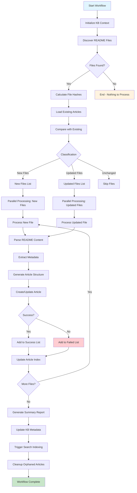

# CollectSystemDocsWorkflow Specification

## Overview

The CollectSystemDocsWorkflow is designed to automatically discover, collect, process, and organize README documentation files from across the Reactory platform ecosystem into a comprehensive, searchable knowledge base. This workflow ensures the system maintains an up-to-date, consistent documentation repository that reflects the current state of the codebase.

## Purpose

Create and maintain a living knowledge base of the Reactory platform by:
- Discovering all README files across modules and core platform
- Processing and transforming documentation into structured articles
- Organizing content with appropriate metadata and categorization
- Detecting changes and updating articles when documentation evolves
- Providing AI-enhanced documentation through intelligent indexing
- Maintaining documentation hierarchy and relationships

## Scope

### In Scope
- **Core Platform**: Main Reactory server and core module documentation
- **Reactory Modules**: All enabled and installed modules in `src/modules/*`
- **Client Applications**: PWA Client, Native Client documentation
- **Shared Libraries**: Reactory Core types and definitions
- **Data Repositories**: Documentation in data and plugin folders

### Out of Scope
- Generated documentation (API docs, JSDoc output)
- Temporary or build artifacts
- Third-party library documentation
- Code comments (unless part of README)
- Changelog files (handled separately)

## Workflow Architecture

### Design Principles

1. **Idempotent**: Can be run multiple times without creating duplicates
2. **Incremental**: Only processes changed files on subsequent runs
3. **Resilient**: Handles missing files, permission errors gracefully
4. **Observable**: Comprehensive logging and progress tracking
5. **Efficient**: Parallel processing where possible
6. **Consistent**: Creates standardized article structure
7. **Traceable**: Maintains source mapping for all articles

### Workflow Diagram



## Detailed Step Breakdown

### Phase 1: Discovery & Initialization

#### Step 1: Initialize KB Context
**Purpose**: Set up the knowledge base and workflow context

**Actions**:
- Validate KB service availability
- Create or retrieve "System Documentation" knowledge base
- Initialize workflow tracking state
- Load configuration parameters
- Set up error handling context

**Outputs**:
- `kbId`: Knowledge base identifier
- `workflowState`: Tracking object
- `config`: Workflow configuration

**Error Handling**:
- KB service unavailable: Fail workflow with clear error
- Permission denied: Log error and request admin intervention
- Invalid configuration: Use defaults and warn

---

#### Step 2: Discover README Files
**Purpose**: Scan the filesystem for all README documentation

**Scan Locations**:
```typescript
const scanPaths = [
  // Core platform
  process.env.REACTORY_SERVER + '/README.md',
  process.env.REACTORY_SERVER + '/src/modules/*/README.md',
  
  // Client applications  
  process.env.REACTORY_CLIENT + '/README.md',
  process.env.REACTORY_CLIENT + '/src/components/*/README.md',
  process.env.REACTORY_NATIVE + '/README.md',
  
  // Core library
  process.env.REACTORY_CORE + '/README.md',
  
  // Data repositories
  process.env.REACTORY + '/reactory-data/README.md',
  
  // Specific module subdirectories
  process.env.REACTORY_SERVER + '/src/modules/*/workflow/*/README.md',
  process.env.REACTORY_SERVER + '/src/modules/*/services/README.md',
  process.env.REACTORY_SERVER + '/src/modules/*/models/*/README.md',
]
```

**File Discovery Strategy**:
- Use glob patterns for efficient file matching
- Respect `.gitignore` patterns
- Exclude `node_modules`, `dist`, `build` directories
- Follow symlinks with cycle detection
- Capture full file metadata (path, size, modified date)

**Outputs**:
- `discoveredFiles`: Array of file metadata objects
- `scanStats`: Statistics about discovery process

**Error Handling**:
- Permission errors: Log and skip directory
- Path not found: Log warning and continue
- Symlink cycles: Detect and break

---

#### Step 3: Calculate File Hashes
**Purpose**: Generate content hashes for change detection

**Process**:
- Read each discovered file
- Calculate SHA-256 hash of content
- Store hash with file metadata
- Handle encoding issues (UTF-8)

**Optimization**:
- Process files in parallel (batches of 10)
- Cache hashes in workflow state
- Skip unreadable files

**Outputs**:
- `fileManifest`: Array of files with hashes
- `hashErrors`: Files that couldn't be hashed

---

### Phase 2: Change Detection

#### Step 4: Load Existing Articles
**Purpose**: Retrieve current documentation articles from KB

**Process**:
- Query articles with tag: `system-documentation`
- Load article metadata including source paths
- Build lookup map by source path
- Track orphaned articles (source file missing)

**Outputs**:
- `existingArticles`: Map of path → article
- `orphanedArticles`: Articles without source files

---

#### Step 5: Classify File Changes
**Purpose**: Determine what needs updating

**Classification Logic**:
```typescript
for (const file of fileManifest) {
  const existing = existingArticles.get(file.path);
  
  if (!existing) {
    newFiles.push(file);
  } else if (existing.hash !== file.hash) {
    updatedFiles.push(file);
  } else {
    unchangedFiles.push(file);
  }
}
```

**Outputs**:
- `newFiles`: Files not in KB
- `updatedFiles`: Files with content changes
- `unchangedFiles`: Files with no changes

---

### Phase 3: Content Processing

#### Step 6: Process Files (Parallel)
**Purpose**: Transform README content into KB articles

**Sub-Steps for Each File**:

##### 6.1: Parse README Content
- Read file with proper encoding
- Parse Markdown structure
- Extract title from first H1
- Extract description from first paragraph
- Identify sections and subsections

##### 6.2: Extract Metadata
**Automatic Detection**:
```typescript
interface ExtractedMetadata {
  title: string;           // From first H1 or filename
  description: string;     // First paragraph
  moduleId?: string;       // From path pattern
  namespace?: string;      // From module structure
  category: string;        // 'core' | 'module' | 'client' | 'workflow' | 'service'
  tags: string[];          // Auto-generated
  relativePath: string;    // Relative to REACTORY_HOME
  absolutePath: string;    // Full filesystem path
  lastModified: Date;      // File mtime
  contentHash: string;     // SHA-256 hash
}
```

**Tag Generation Rules**:
- Always add: `system-documentation`, `auto-generated`
- From path: Module name (e.g., `reactory-kb`, `reactory-core`)
- From content: Extract keywords from headers
- From category: `core-platform`, `module-docs`, `client-docs`, etc.

##### 6.3: Generate Article Structure
**Article Schema**:
```typescript
interface DocumentationArticle {
  title: string;
  slug: string;                    // Generated from title + path
  description: string;
  content: string;                 // Full README content
  contentType: 'article';
  knowledgeBase: ObjectId;         // System Documentation KB
  status: 'published';
  lng: 'en';
  tags: string[];
  categories: string[];            // Hierarchical path
  
  // Custom metadata
  metadata: {
    sourcePath: string;            // Absolute path
    sourceRelativePath: string;    // Relative path
    sourceHash: string;            // Content hash
    moduleId?: string;             // Module identifier
    lastSynced: Date;              // Workflow run time
    autoGenerated: true;
    documentationType: string;     // 'readme' | 'workflow' | 'service'
  };
}
```

##### 6.4: Create or Update Article
**For New Files**:
- Create new article with ArticleService
- Set status to 'published'
- Create initial version

**For Updated Files**:
- Update existing article content
- Create new version with change summary
- Preserve article ID and slug

**Batch Processing**:
- Process 5 files in parallel
- Collect results (success/failure)
- Continue on individual failures

**Outputs (Per File)**:
- Success: Article ID and metadata
- Failure: Error details and file info

---

### Phase 4: Indexing & Cleanup

#### Step 7: Update Article Index
**Purpose**: Maintain article relationship index

**Process**:
- Build category hierarchy from paths
- Link related articles (same module)
- Create navigation structure
- Update KB statistics

**Index Structure**:
```typescript
interface DocumentationIndex {
  categories: {
    'core-platform': ArticleRef[];
    'modules': {
      [moduleName]: ArticleRef[];
    };
    'clients': {
      'pwa': ArticleRef[];
      'native': ArticleRef[];
    };
    'workflows': ArticleRef[];
    'services': ArticleRef[];
  };
  totalArticles: number;
  lastUpdated: Date;
}
```

---

#### Step 8: Trigger Search Indexing
**Purpose**: Update search indexes for new/changed content

**Process**:
- Call SearchService with updated article IDs
- Request full-text indexing
- Update search metadata
- Invalidate search cache

**Async Processing**:
- Fire and forget (don't block workflow)
- Log indexing request
- Handle errors gracefully

---

#### Step 9: Cleanup Orphaned Articles
**Purpose**: Remove articles for deleted README files

**Process**:
- Identify orphaned articles
- Check if files were moved (fuzzy matching)
- Archive orphaned articles (don't delete)
- Log cleanup actions

**Safety**:
- Never delete without confirmation
- Maintain audit trail
- Support manual override

---

#### Step 10: Generate Summary Report
**Purpose**: Create workflow execution summary

**Report Contents**:
```typescript
interface WorkflowReport {
  executionId: string;
  startTime: Date;
  endTime: Date;
  duration: number;
  
  discovery: {
    filesScanned: number;
    filesFound: number;
    scanPaths: string[];
    errors: ErrorSummary[];
  };
  
  processing: {
    newArticles: number;
    updatedArticles: number;
    unchangedFiles: number;
    failedFiles: number;
    totalProcessed: number;
  };
  
  cleanup: {
    orphanedArticles: number;
    archivedArticles: number;
  };
  
  performance: {
    avgProcessingTime: number;
    parallelBatches: number;
    peakMemoryUsage: number;
  };
  
  errors: ErrorDetail[];
  warnings: WarningDetail[];
}
```

---

## Error Handling Strategy

### Error Categories

#### 1. File System Errors
**Symptoms**: Permission denied, file not found, encoding issues

**Recovery**:
- Log error with full context
- Skip problematic file
- Continue with remaining files
- Report in summary

#### 2. Content Processing Errors
**Symptoms**: Malformed markdown, encoding issues, empty files

**Recovery**:
- Use fallback parsing
- Generate minimal article structure
- Tag as needs-review
- Alert administrators

#### 3. KB Service Errors
**Symptoms**: Article creation failed, duplicate slug

**Recovery**:
- Retry with exponential backoff (3 attempts)
- Generate unique slug for duplicates
- Fall back to error collection
- Continue processing

#### 4. Critical Failures
**Symptoms**: KB unavailable, database connection lost

**Recovery**:
- Halt workflow immediately
- Save state for resume
- Alert administrators
- Provide restart instructions

### Retry Strategy

```typescript
const retryConfig = {
  maxAttempts: 3,
  initialDelay: 1000,
  maxDelay: 10000,
  backoffMultiplier: 2,
  retryableErrors: [
    'ECONNRESET',
    'ETIMEDOUT',
    'ENOTFOUND',
    'DuplicateKeyError'
  ]
};
```

---

## Performance Optimization

### Parallel Processing

**File Discovery**: 
- Scan multiple paths concurrently
- Batch glob operations

**Hash Calculation**:
- Process 10 files in parallel
- Stream large files

**Article Processing**:
- Process 5 articles in parallel
- Use connection pooling

**Memory Management**:
- Stream file reading for large READMEs
- Clear processed files from memory
- Monitor heap usage

### Caching Strategy

**Workflow State Cache**:
- Cache file hashes between runs
- Store in workflow data directory
- Invalidate on manual trigger

**Article Lookup Cache**:
- In-memory map during execution
- Clear after workflow completion

---

## Configuration

### Environment Variables

```bash
# Knowledge Base Configuration
KB_SYSTEM_DOCS_KB_ID=          # Specific KB to use (optional)
KB_SYSTEM_DOCS_AUTO_CREATE=true # Create KB if missing
KB_SYSTEM_DOCS_PARALLEL_LIMIT=5 # Max parallel processing

# Discovery Configuration
KB_DOCS_SCAN_SYMLINKS=true     # Follow symlinks
KB_DOCS_MAX_FILE_SIZE=5242880  # 5MB max file size
KB_DOCS_EXCLUDE_PATTERNS=      # Additional exclude patterns

# Processing Configuration
KB_DOCS_RETRY_ATTEMPTS=3       # Retry failed operations
KB_DOCS_BATCH_SIZE=10          # Files per batch

# Cleanup Configuration
KB_DOCS_ARCHIVE_ORPHANS=true   # Archive vs delete
KB_DOCS_ORPHAN_GRACE_DAYS=7    # Days before cleanup
```

### Workflow Parameters

```typescript
interface CollectSystemDocsInput {
  forceFullScan?: boolean;       // Ignore change detection
  targetPaths?: string[];        // Override default paths
  dryRun?: boolean;              // Simulate without changes
  excludePatterns?: string[];    // Additional exclusions
  includeDrafts?: boolean;       // Include draft READMEs
  preserveOrphans?: boolean;     // Don't cleanup orphans
}
```

---

## Monitoring & Observability

### Metrics Collected

- Files discovered per scan path
- Processing time per file
- Success/failure rates
- Article creation/update counts
- Hash calculation duration
- Memory usage throughout workflow
- Error counts by category

### Logging Strategy

**Levels**:
- `DEBUG`: File-level operations
- `INFO`: Step completions, counts
- `WARN`: Recoverable errors
- `ERROR`: Failed operations

**Structured Logging**:
```typescript
logger.info('README file processed', {
  workflowId,
  stepName: 'ProcessFile',
  filePath: file.path,
  articleId: article.id,
  processingTime: duration,
  status: 'success'
});
```

---

## Testing Strategy

### Unit Tests
- File discovery logic
- Hash calculation
- Metadata extraction
- Article transformation
- Error handling

### Integration Tests
- End-to-end workflow execution
- KB service integration
- File system operations
- Parallel processing

### Smoke Tests
- Workflow registration
- Basic discovery
- Simple article creation

---

## Scheduling

### Recommended Schedule

```yaml
schedules:
  - id: daily-docs-sync
    name: Daily Documentation Sync
    cron: '0 2 * * *'          # 2 AM daily
    enabled: true
    
  - id: hourly-quick-sync
    name: Hourly Quick Sync
    cron: '0 * * * *'          # Every hour
    enabled: false             # Enable for active development
    params:
      forceFullScan: false
```

### Manual Triggers

- On demand via API
- After module installation
- After major updates
- Developer request

---

## Future Enhancements

### Phase 2 Features
1. **Intelligent Change Detection**
   - Semantic diffing of content
   - Preserve manual edits
   - Merge conflict resolution

2. **AI Enhancement**
   - Automatic section summaries
   - Cross-reference suggestions
   - Documentation quality scoring

3. **Multi-Format Support**
   - Confluence exports
   - Google Docs integration
   - Notion page sync

4. **Advanced Indexing**
   - Code example extraction
   - API endpoint documentation
   - Dependency graph visualization

---

## Success Criteria

### Functional Requirements
- ✅ Discovers all README files in system
- ✅ Creates articles for new documentation
- ✅ Updates articles when content changes
- ✅ Maintains accurate source mapping
- ✅ Handles errors gracefully
- ✅ Generates comprehensive reports

### Non-Functional Requirements
- ✅ Completes full scan in < 5 minutes
- ✅ Processes 100+ files efficiently
- ✅ Uses < 500MB memory peak
- ✅ Maintains 99% success rate
- ✅ Idempotent execution
- ✅ Zero data loss on failures

---

## Glossary

- **Knowledge Base (KB)**: Container for related articles
- **Article**: Individual documentation content item
- **Source Mapping**: Link between README file and KB article
- **Content Hash**: SHA-256 checksum for change detection
- **Orphaned Article**: Article whose source file is deleted
- **Workflow State**: Persistent data across workflow steps
- **Metadata Extraction**: Process of deriving article properties from content

---

## References

- [Reactory KB Module Specification](../SPEC.md)
- [Workflow System Documentation](../../reactory-core/workflow/README.md)
- [CatalogMessages Workflow Example](../../zepz-engineer/workflow/CatalogMessages/)
- [Article Service API](../services/ArticleService.ts)
- [Knowledge Base Service API](../services/KnowledgeBaseService.ts)
