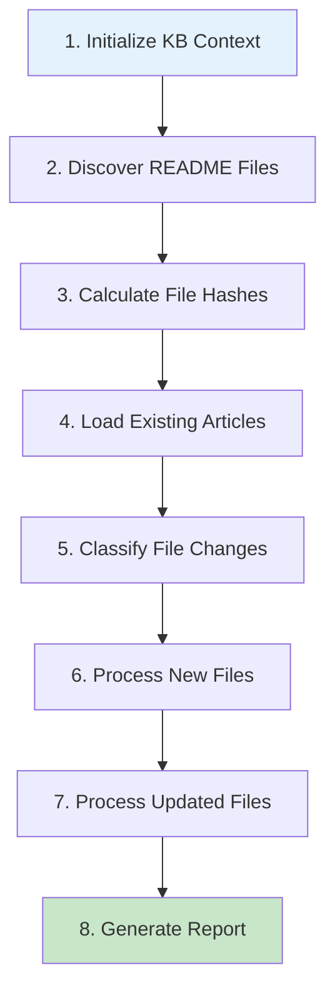

# CollectSystemDocs Workflow

## Overview

The **CollectSystemDocsWorkflow** automatically discovers, processes, and maintains a comprehensive knowledge base of README documentation across the entire Reactory platform ecosystem.

## Purpose

This workflow ensures that all README files from modules, core platform, client applications, and data repositories are:
- **Discovered**: Automatically found across the codebase
- **Processed**: Transformed into structured KB articles
- **Updated**: Kept in sync with source file changes
- **Organized**: Properly categorized and tagged
- **Searchable**: Indexed for quick discovery

## Key Features

### 🔍 Intelligent Discovery
- Scans predefined paths across the platform
- Excludes build artifacts and dependencies
- Respects size limits and file permissions
- Parallel processing for efficiency

### 🔄 Change Detection
- SHA-256 content hashing
- Incremental updates (only changed files)
- Detects new, updated, and deleted files
- Preserves manual edits (optional)

### 📚 Smart Organization
- Extracts metadata from file paths
- Auto-generates categories and tags
- Maintains module relationships
- Creates hierarchical structure

### 🛡️ Robustness
- Graceful error handling
- Continues on individual failures
- Comprehensive logging
- Detailed reporting

### ⚡ Performance
- Parallel file processing
- Batched operations
- Memory-efficient streaming
- Progress tracking

## Workflow Steps

The workflow executes in the following sequence:



### Step Details

1. **Initialize KB Context**
   - Creates/loads "System Documentation" KB
   - Sets up workflow tracking
   - Validates services

2. **Discover README Files**
   - Scans configured paths
   - Filters by size and patterns
   - Extracts path metadata

3. **Calculate File Hashes**
   - Computes SHA-256 checksums
   - Parallel processing (10 files/batch)
   - Caches content for next steps

4. **Load Existing Articles**
   - Queries KB for documentation articles
   - Builds path → article mapping
   - Identifies orphaned articles

5. **Classify File Changes**
   - Compares hashes with existing
   - Categorizes: new, updated, unchanged
   - Plans processing strategy

6. **Process New Files**
   - Creates KB articles for new READMEs
   - Extracts title, description, metadata
   - Generates tags and categories
   - Parallel processing (5 files/batch)

7. **Process Updated Files**
   - Updates changed articles
   - Creates version history
   - Preserves article relationships
   - Parallel processing (5 files/batch)

8. **Generate Report**
   - Compiles statistics
   - Logs errors and warnings
   - Performance metrics
   - Success/failure summary

## Usage

### Starting the Workflow

#### Via GraphQL
```graphql
mutation {
  startWorkflow(
    workflowId: "kb.CollectSystemDocsWorkflow@1.0.0"
    input: {
      data: {
        forceFullScan: false
        dryRun: false
      }
    }
  ) {
    id
    status
    startedAt
  }
}
```

#### Via REST API
```bash
curl -X POST http://localhost:4000/workflow/start/kb.CollectSystemDocsWorkflow@1.0.0 \
  -H "Content-Type: application/json" \
  -H "Authorization: Bearer YOUR_TOKEN" \
  -d '{
    "forceFullScan": false,
    "dryRun": false
  }'
```

#### Via CLI
```bash
# From the server directory
bin/cli.sh workflow:run kb.CollectSystemDocsWorkflow@1.0.0
```

### Input Parameters

```typescript
interface CollectSystemDocsInput {
  forceFullScan?: boolean;       // Ignore change detection, process all
  targetPaths?: string[];        // Override default scan paths
  dryRun?: boolean;              // Simulate without creating articles
  excludePatterns?: string[];    // Additional glob patterns to exclude
  includeDrafts?: boolean;       // Process draft README files
  preserveOrphans?: boolean;     // Don't cleanup deleted files
}
```

### Example: Dry Run
```json
{
  "dryRun": true,
  "forceFullScan": false
}
```

### Example: Custom Paths
```json
{
  "targetPaths": [
    "src/modules/reactory-kb/README.md",
    "src/modules/reactory-kb/**/README.md"
  ],
  "excludePatterns": [
    "**/node_modules/**"
  ]
}
```

## Configuration

### Environment Variables

```bash
# Knowledge Base
KB_SYSTEM_DOCS_NAME="System Documentation"
KB_SYSTEM_DOCS_AUTO_CREATE=true
KB_SYSTEM_USER=system@reactory.io
KB_SYSTEM_PARTNER=reactory

# Discovery
KB_DOCS_MAX_FILE_SIZE=5242880        # 5MB
KB_DOCS_SCAN_SYMLINKS=true

# Processing
KB_DOCS_PARALLEL_LIMIT=5
KB_DOCS_BATCH_SIZE=10

# Cleanup
KB_DOCS_ARCHIVE_ORPHANS=true
KB_DOCS_ORPHAN_GRACE_DAYS=7
```

### Default Scan Paths

The workflow scans these paths by default (relative to `REACTORY_SERVER`):

```
README.md
src/modules/*/README.md
src/modules/*/workflow/*/README.md
src/modules/*/services/README.md
src/modules/*/models/*/README.md
src/modules/*/routes/README.md
```

### Excluded Patterns

```
**/node_modules/**
**/dist/**
**/build/**
**/.git/**
**/coverage/**
```

## Output & Reporting

### Success Output

```json
{
  "stats": {
    "discovery": {
      "filesScanned": 150,
      "filesFound": 47,
      "scanPaths": 6,
      "errors": 0
    },
    "processing": {
      "newArticles": 5,
      "updatedArticles": 3,
      "unchangedFiles": 39,
      "failedFiles": 0,
      "totalProcessed": 8
    },
    "cleanup": {
      "orphanedArticles": 2,
      "archivedArticles": 0
    },
    "performance": {
      "avgProcessingTime": 1250,
      "totalDuration": 15430,
      "peakMemoryUsage": 128.5
    }
  },
  "errors": [],
  "warnings": []
}
```

### Error Handling

The workflow handles errors gracefully:

- **File Access Errors**: Logged and skipped
- **Parse Errors**: Use fallback extraction
- **KB Service Errors**: Retry with backoff
- **Critical Failures**: Halt with state save

All errors are collected and reported in the final summary.

## Scheduling

### Recommended Schedules

#### Daily Full Sync
```yaml
id: daily-docs-sync
name: Daily Documentation Sync
cron: '0 2 * * *'
enabled: true
params:
  forceFullScan: false
```

#### Hourly Quick Sync (Dev)
```yaml
id: hourly-quick-sync
name: Hourly Quick Check
cron: '0 * * * *'
enabled: false
params:
  forceFullScan: false
```

#### Weekly Deep Scan
```yaml
id: weekly-deep-scan
name: Weekly Full Scan
cron: '0 3 * * 0'
enabled: true
params:
  forceFullScan: true
```

## Monitoring

### Key Metrics

Monitor these metrics for workflow health:

- **Discovery Rate**: Files found vs scanned
- **Processing Success**: Success vs failure ratio
- **Execution Time**: Total and per-file duration
- **Memory Usage**: Peak heap consumption
- **Error Rate**: Errors per execution

### Logging

All workflow steps log to the standard Reactory logger:

```typescript
logger.info('[CollectSystemDocs] Step complete', {
  step: 'ProcessNewFiles',
  filesProcessed: 5,
  duration: 1250
});
```

Filter logs with:
```bash
grep "CollectSystemDocs" logs/reactory-*.log
```

## Troubleshooting

### Common Issues

#### No Files Discovered
**Symptoms**: `filesFound: 0`

**Solutions**:
- Check `REACTORY_SERVER` environment variable
- Verify README files exist in scan paths
- Check file permissions
- Review exclude patterns

#### Processing Failures
**Symptoms**: High `failedFiles` count

**Solutions**:
- Check file encoding (must be UTF-8)
- Verify KB service is running
- Review error logs for specifics
- Check file size limits

#### Duplicate Articles
**Symptoms**: Slug collision errors

**Solutions**:
- Run with `forceFullScan: true` once
- Check for duplicate file paths
- Manually resolve conflicts in KB

#### Memory Issues
**Symptoms**: High `peakMemoryUsage`

**Solutions**:
- Reduce `KB_DOCS_PARALLEL_LIMIT`
- Decrease `KB_DOCS_BATCH_SIZE`
- Increase Node.js heap size

### Debug Mode

Enable verbose logging:

```bash
DEBUG=reactory:kb:workflow:* bin/cli.sh workflow:run kb.CollectSystemDocsWorkflow@1.0.0
```

## Best Practices

### 1. Start with Dry Run
Always test with `dryRun: true` first to preview changes.

### 2. Monitor First Execution
Watch logs and metrics on initial run to establish baseline.

### 3. Schedule Off-Peak
Run during low-usage periods (early morning).

### 4. Gradual Rollout
Start with specific modules, then expand to full platform.

### 5. Regular Cleanup
Review and archive orphaned articles periodically.

### 6. Version Control
Commit workflow configuration changes to version control.

## Advanced Usage

### Custom Article Transformation

Extend the workflow to customize article generation:

```typescript
// In your extended workflow
private extractArticleMetadata(file: FileWithHash): any {
  const base = super.extractArticleMetadata(file);
  
  // Add custom logic
  if (file.moduleId === 'reactory-kb') {
    base.tags.push('knowledge-base', 'core-module');
  }
  
  return base;
}
```

### Integration with CI/CD

Trigger on deployment:

```yaml
# .github/workflows/deploy.yml
- name: Update Documentation KB
  run: |
    curl -X POST $WORKFLOW_API_URL \
      -H "Authorization: Bearer $API_TOKEN" \
      -d '{"workflowId": "kb.CollectSystemDocsWorkflow@1.0.0"}'
```

### Webhook Notifications

Notify on completion:

```typescript
// Add to GenerateWorkflowReport step
if (stats.processing.newArticles > 0) {
  await notifySlack({
    channel: '#documentation',
    message: `📚 Documentation updated: ${stats.processing.newArticles} new articles`
  });
}
```

## Performance Benchmarks

Typical performance on standard hardware:

| Files | Duration | Memory | Articles/sec |
|-------|----------|--------|--------------|
| 50    | ~15s     | 120MB  | 3.3          |
| 100   | ~28s     | 180MB  | 3.6          |
| 200   | ~55s     | 250MB  | 3.6          |

## Related Documentation

- [Workflow Specification](./CollectSystemDocsWorkflow.specification.md)
- [KB Module Documentation](../../README.md)
- [Article Service API](../../services/ArticleService.ts)
- [Knowledge Base Service API](../../services/KnowledgeBaseService.ts)
- [Workflow System Guide](../../../reactory-core/workflow/README.md)

## Contributing

To enhance this workflow:

1. Review the specification document
2. Test changes with `dryRun: true`
3. Add unit tests for new steps
4. Update documentation
5. Submit PR with examples

## License

This workflow is part of the Reactory platform and follows the same licensing terms.
