# CollectSystemDocs Workflow - Visual Diagram

## High-Level Overview

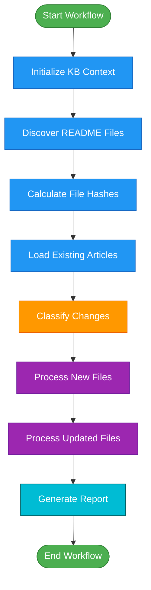

## Detailed Workflow with Error Handling

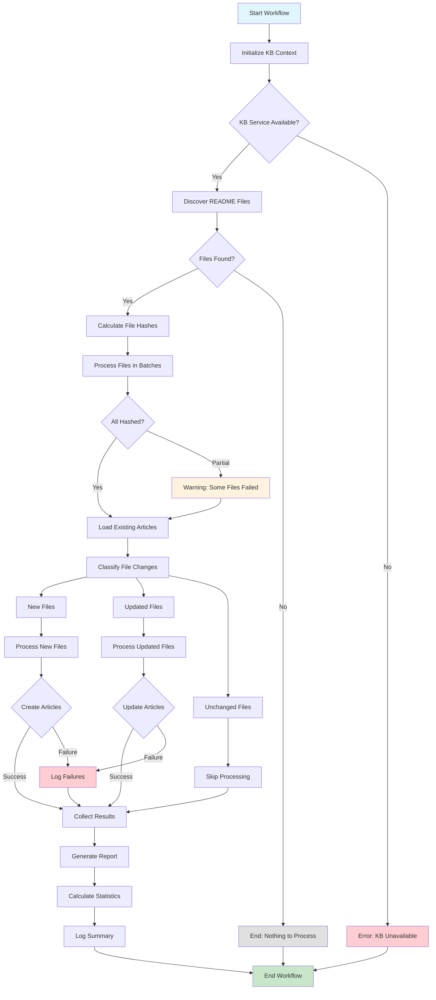

## File Discovery & Classification Flow

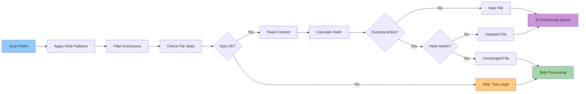

## Article Processing Pipeline

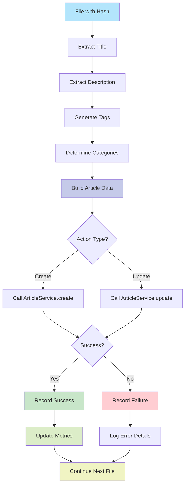

## Parallel Processing Strategy

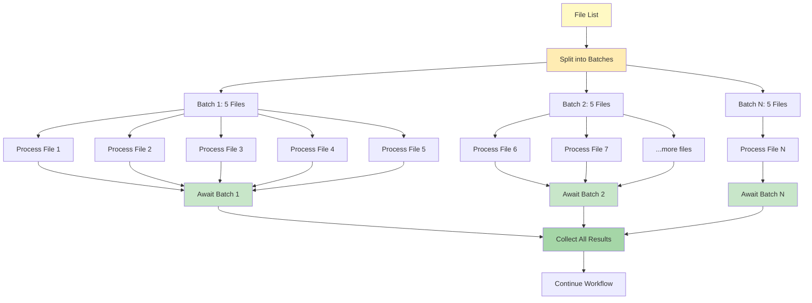

## Error Handling & Recovery

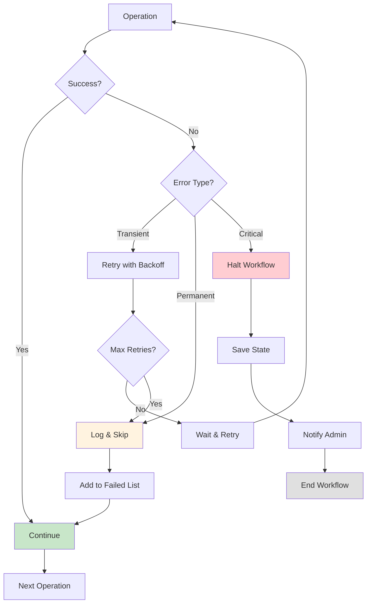

## State Transitions

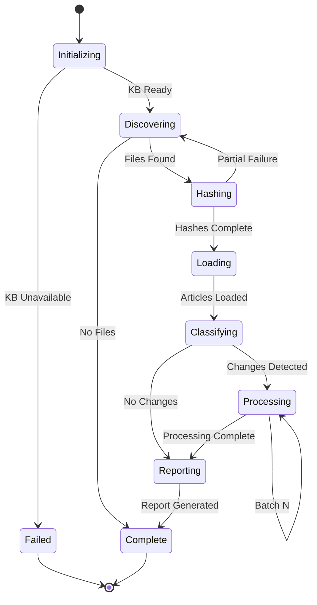

## Data Flow Diagram

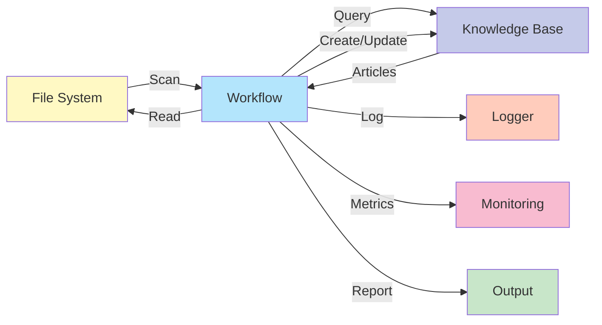

## Performance Optimization

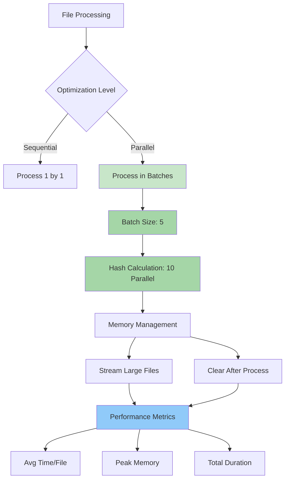

## Workflow Lifecycle

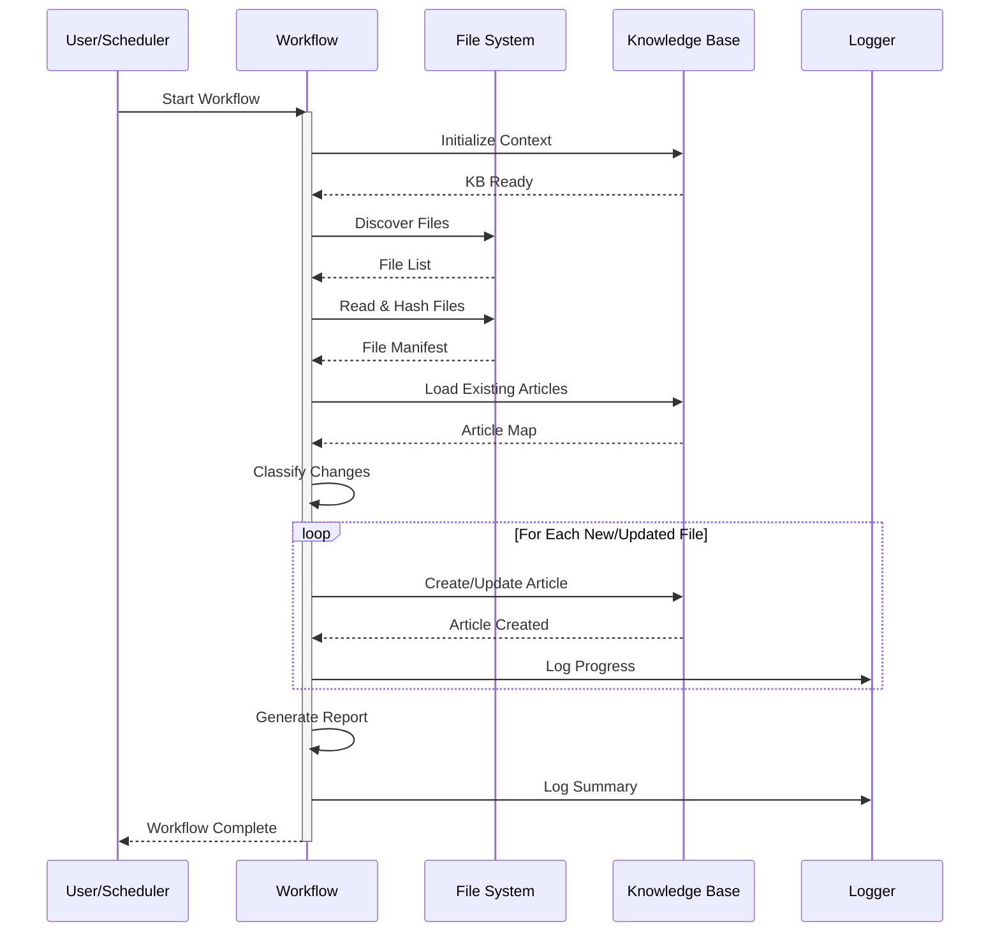

## Integration Points

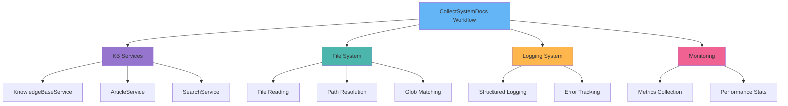

## Legend

### Color Coding

- 🟦 **Blue**: Initialization & Setup Steps
- 🟪 **Purple**: Processing Operations
- 🟧 **Orange**: Decision Points
- 🟩 **Green**: Success States
- 🟥 **Red**: Error States
- 🟨 **Yellow**: Warning States
- ⬜ **Gray**: Terminal States

### Symbol Guide

- **Rectangle**: Process/Action
- **Diamond**: Decision Point
- **Rounded Rectangle**: Start/End
- **Cylinder**: Data Store
- **Hexagon**: External Service
- **Parallelogram**: Input/Output
